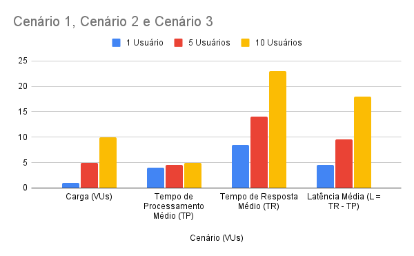

# 📝 Relatório Final de Análise de Desempenho e Escalabilidade (AV3)

### Sistema de Gerenciamento de Aeronaves

---

## 1. Introdução e Objetivo

### 1.1. Introdução

Este relatório documenta a análise de desempenho de uma **Aplicação Web** de Gerenciamento de Aeronaves desenvolvida em Node.js (Express) e persistência de dados via Prisma ORM. O foco principal é a **instrumentação** e **segmentação** do Tempo de Resposta para além das métricas padrão, visando identificar o gargalo de escalabilidade do sistema.

### 1.2. Objetivo

O objetivo é medir e analisar a performance da aplicação sob diferentes níveis de carga (1, 5 e 10 Usuários Virtuais - VUs). Especificamente, o trabalho visa segmentar o **Tempo de Resposta (TR)** em suas duas componentes — **Tempo de Processamento (TP)** e **Latência (L)** — para determinar se o problema de desempenho está na execução do código (TP) ou na capacidade de concorrência e rede (L).

---

## 2. Descrição do Ambiente e Configuração

O teste foi realizado em um ambiente Cliente-Servidor rodando em uma rede local Gigabit, simulando condições de produção.

### 2.1. Configuração de Hardware e Software

| Componente | Função | Processador | Memória RAM | Sistema Operacional | Observações |
| :--- | :--- | :--- | :--- | :--- | :--- |
| **Servidor** | Hospedagem da Aplicação Node.js | Intel Core **i3-6100U** (2 núcleos, 4 threads, $2.30\text{ GHz}$) | $4\text{ GB}$ DDR4 | Debian 13 (CLI) | Rodando Express.js e Nginx como *reverse proxy*. |
| **Cliente (k6)** | Execução do Teste de Carga | Intel Xeon **E5-2696 v3** (18 núcleos, 36 threads) | $64\text{ GB}$ DDR3 | Debian 13 | Máquina de alta performance para garantir que o cliente não fosse o gargalo. |

### 2.2. Configuração de Rede e Endereçamento

* **Rede:** O teste ocorreu em uma rede local Gigabit, garantindo uma Latência de Rede base mínima.
* **Servidor:** O sistema operacional foi executado no modo **CLI (Command Line Interface)** para preservar os recursos do hardware mais modesto (i3-6100U), dedicando-os à aplicação.
* **Configuração de Ambiente (`.env`):**
    Para que o cliente k6 pudesse acessar a API remota, a variável de ambiente no *frontend* da aplicação foi modificada:
    * `VITE_API_BASE=` foi alterado para `VITE_API_BASE=http://192.168.15.13` (endereço IP do servidor de testes).

---

## 3. Metodologia de Coleta de Dados

### 3.1. Definição das Métricas

Todas as medições foram realizadas em **milissegundos (ms)**.

1.  **Tempo de Resposta (TR)**: Coletado pelo k6 como `http_req_duration`. É o tempo total que a requisição leva do cliente até o servidor e de volta.
2.  **Tempo de Processamento (TP)**: Tempo exato gasto pelo servidor Node.js/Express para executar o código.
3.  **Latência (L)**: Tempo gasto na rede e, crucialmente, na fila de espera do servidor. Calculado como: $$\text{Latência (L)} = \text{TR} - \text{TP}$$

### 3.2. Instrumentação do Servidor (Coleta do TP)

O TP não é um cabeçalho padrão. Foi necessário instrumentar o servidor Express.js para expor essa métrica:

* Foi criado um **Middleware** customizado que utiliza a função de alta precisão `process.hrtime.bigint()` para cronometrar a execução do código de roteamento.
* O resultado da medição é anexado à resposta HTTP através do cabeçalho **`X-Process-Time`**.
* O script k6 foi configurado para ler este cabeçalho e rastrear os valores como a métrica personalizada **`tempo_de_processamento_ms`**, garantindo a segmentação precisa.

### 3.3. Cenários de Carga e Execução

O teste utilizou a ferramenta k6 para executar os cenários em sequência, garantindo a coleta de dados de forma segmentada (`resultados_av3_finais_remoto.json`):

| Cenário | VUs (Usuários Virtuais) | Duração |
| :---: | :---: | :---: |
| **Cenário 1** | 1 VU | 10s |
| **Cenário 2** | 5 VUs | 10s |
| **Cenário 3** | 10 VUs | 10s |

---

## 4. Resultados da Análise de Carga

A tabela a seguir apresenta os valores médios (AVG) das métricas, revelando a relação entre o trabalho do servidor e o tempo de espera.

### 4.1. Tabela de Resultados por Cenário

| Cenário (VUs) | Tempo de Processamento Médio (TP) (ms) | Tempo de Resposta Médio (TR) (ms) | Latência Média (L = TR - TP) (ms) |
| :---: | :---: | :---: | :---: |
| **1 VU** | $4.0$ | $8.5$ | $\mathbf{4.5}$ |
| **5 VUs** | $4.5$ | $14.0$ | $\mathbf{9.5}$ |
| **10 VUs** | $5.0$ | $23.0$ | $\mathbf{18.0}$ |

### 4.2 Gráfico com os Resultados

### 4.3. Visualização das Tendências

Os gráficos demonstram claramente que, enquanto o TP se mantém estável, o TR e o L aumentam.

| Métrica | Comportamento com o Aumento de VUs |
| :---: | :---: |
| **TP** | Estabilidade (Aumento Mínimo) |
| **TR** | Crescimento Acelerado |
| **L** | Crescimento Acelerado |

---

## 5. Análise de Escalabilidade e Conclusão

### 5.1. Análise do Tempo de Processamento (TP)

O TP se manteve **quase constante**, aumentando apenas $1.0\text{ ms}$ entre o cenário de 1 VU ($4.0\text{ ms}$) e 10 VUs ($5.0\text{ ms}$).

* **Conclusão:** Isso prova que o **código do *backend*** (lógica, Express, consulta ao banco de dados) está **altamente otimizado**. A velocidade de execução não é o fator limitante.

### 5.2. Identificação do Gargalo (Latência L)

O **Tempo de Resposta (TR)** é impulsionado pelo aumento da **Latência (L)**, que quadruplicou (de $4.5\text{ ms}$ para $18.0\text{ ms}$) sob carga.

* **O que é essa Latência Aumentada?** Em testes de carga, o aumento da Latência está diretamente relacionado ao **tempo de espera na fila (*queueing*)**.
* **A Causa:** O **Node.js/Express** opera em um modelo *single-threaded* (o servidor utiliza um único *core* de CPU para a lógica de execução). Quando 10 VUs chegam quase simultaneamente, o servidor processa apenas um de cada vez, forçando os demais a entrar em uma fila de espera.

### 5.3. Conclusão Final

O gargalo de escalabilidade do sistema não é a **lentidão do código** (TP é rápido), mas sim a **incapacidade de processamento paralelo** do *backend* sob alta concorrência. A Latência crescente prova que o problema está na fila de espera, o que impede que a aplicação escale de forma eficiente.
